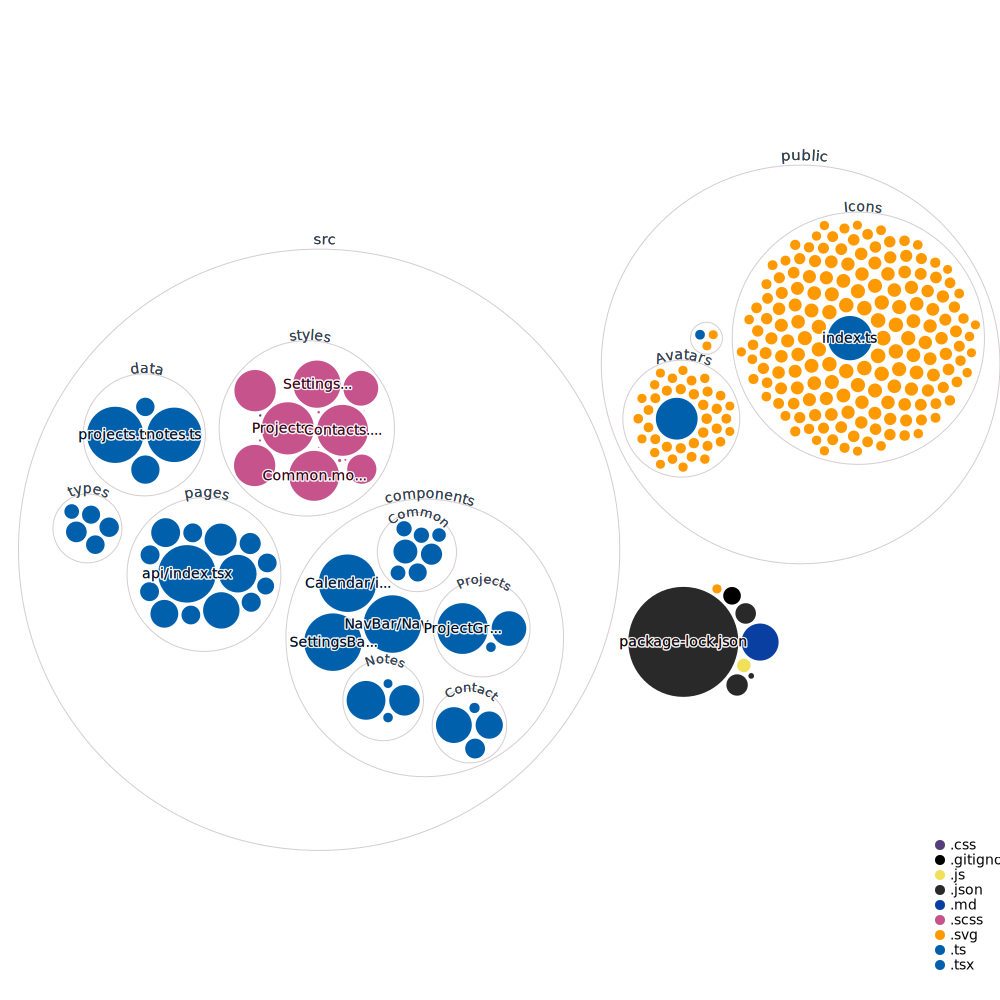

# Next-Alpha

Next-Alpha is a web application built on the Next.js framework that provides users with financial information and analysis tools. The application is designed to be intuitive and user-friendly, with a modern and responsive UI.

## Table of Contents

- [Installation](#installation)
- [Usage](#usage)
- [Features](#features)
- [Contributing](#contributing)
- [License](#license)

## Installation

To install Next-Alpha, follow these steps:

1. Clone the repository: `git clone https://github.com/cconner57/Next-Alpha.git`
2. Install dependencies: `npm install`
3. Start the development server: `npm run dev`

## Usage

To use Next-Alpha, navigate to `http://localhost:3000` in your web browser after starting the development server. From there, you can browse financial information, analyze data, and use the various tools provided by the application.

## Features

Next-Alpha provides the following features:

- Real-time financial data and news
- Stock and market analysis tools
- Financial calculators
- Investment portfolio tracker
- Interactive charts and graphs
- User authentication and profile management
- Customizable dashboard

## Contributing

Contributions are welcome! To contribute to Next-Alpha, follow these steps:

1. Fork the repository
2. Create a new branch: `git checkout -b my-new-feature`
3. Make changes and commit: `git commit -am 'Add new feature'`
4. Push to the branch: `git push origin my-new-feature`
5. Submit a pull request

Please make sure to update tests as appropriate.

## License

Next-Alpha is licensed under the [MIT License](https://opensource.org/licenses/MIT). See `LICENSE` for more information.

